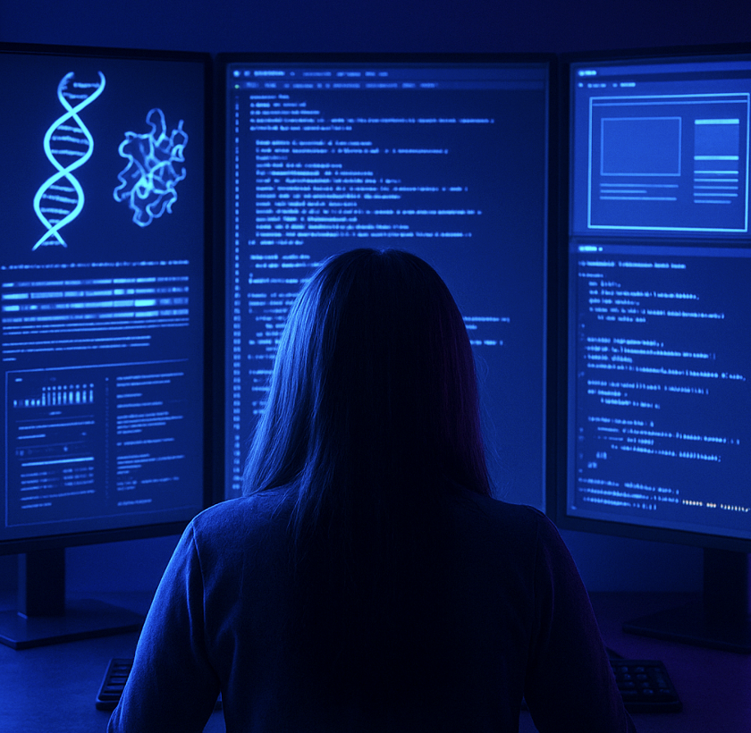

  

<!-- | 👩‍💻 Junior Software Engineer  |   🧬 Molecular Biology & Genetics BSc  |  🎨 UX/UI & Human-Centered Design  |
|--------------------------|----------------------------------------|------------------------------------------| -->
<table width="100%">
  <tr>
    <td align="center">👩‍💻 <b>Junior Software Engineer</b></td>
    <td align="center">🧬 <b>Molecular Biology &amp; Genetics BSc</b></td>
    <td align="center">🎨 <b>UX/UI &amp; Human-Centered Design</b></td>
  </tr>
</table>

## 👋 Hi, I'm Mary Kate!
... an interdisciplinary **STEM graduate** with a background in
molecular biology, genetics, and software engineering.

#
### 🌟 About Me  

- 💻 Software engineering training at [42 Heilbronn](https://www.42heilbronn.de/en/), focused on **C/C++** and Git, with exposure to **web development** and **UX/UI design** through my final, most favourite, project (_"PongJam", check it out below_ ⬇️)

- 🔬 BSc in **Molecular Biology & Genetics** with hands-on wet-lab experience
(PCR/qPCR, DNA/RNA extraction, cloning, mammalian cell culture).

- 🧠 Interested in building clear, well-structured systems –whether in code,
interfaces, or scientific workflows.

- 🌱 Currently expanding my skills in **Python**, bioinformatics concepts,
and user-centered design.

<!-- 
### 🌟 About Me  

- 👩‍🎓 Graduate from the Coding School [42 Heilbronn](https://www.42heilbronn.de/en/), having completed a full-time, project-based program in software engineering.
- 🌱 Passionate about creating intuitive, visually engaging digital experiences that merge logic with creativity.  
- 🔬 With a background in **Molecular Biology & Genetics** and a strong foundation in **C/C++**, I bring analytical precision to frontend design and full-stack development.  
- 🎨 Currently deepening my skills in **TypeScript**, **Tailwind CSS**, and **React** to craft responsive and elegant web interfaces.  
 -->

<!-- ### 🌟 About Me  

<table>
  <tr>
    <td width="60%" valign="top">

- 👩‍🎓 Graduate from the Coding School [42 Heilbronn](https://www.42heilbronn.de/en/), having-completed a full-time, project-based program in software engineering.  
- 🌱 Passionate about creating intuitive, visually engaging digital experiences that merge logic with creativity.  
- 🔬 With a background in **Molecular Biology & Genetics** and a strong foundation in **C/C++**, I bring analytical precision to frontend design and full-stack development.  
- 🎨 Currently deepening my skills in **TypeScript**, **Tailwind CSS**, and exploring **Swift / SwiftUI** to design seamless, user-focused interfaces.

    </td>
    <td width="40%" align="center">
      
    </td>
  </tr>
</table> -->
#
### 💻 Tech Stack  

**Languages:**  

  
  
  
  
  
  
  <!--  -->

**Frameworks & Tools:**  

  
  
  
  

**Currently Learning:**  

  
  
  <!--  -->
  <!--  -->

<!-- #
### 🚀 Favorite Project

My favourite project is [**Transcendence**](https://github.com/MKcodes2/transcendence), _a multiplayer web-based Pong game in a 360° environment_, where I built the frontend with vanilla TypeScript & Tailwind CSS 
> the project that made me fall in love with Frontend

🔍 *Explore more pinned repositories below!* -->

#
### 🤝 Where to Find Me

<!--  -->
 

<!--

-->

#
🔍👇 **Checkout below my favorite projects:**  
